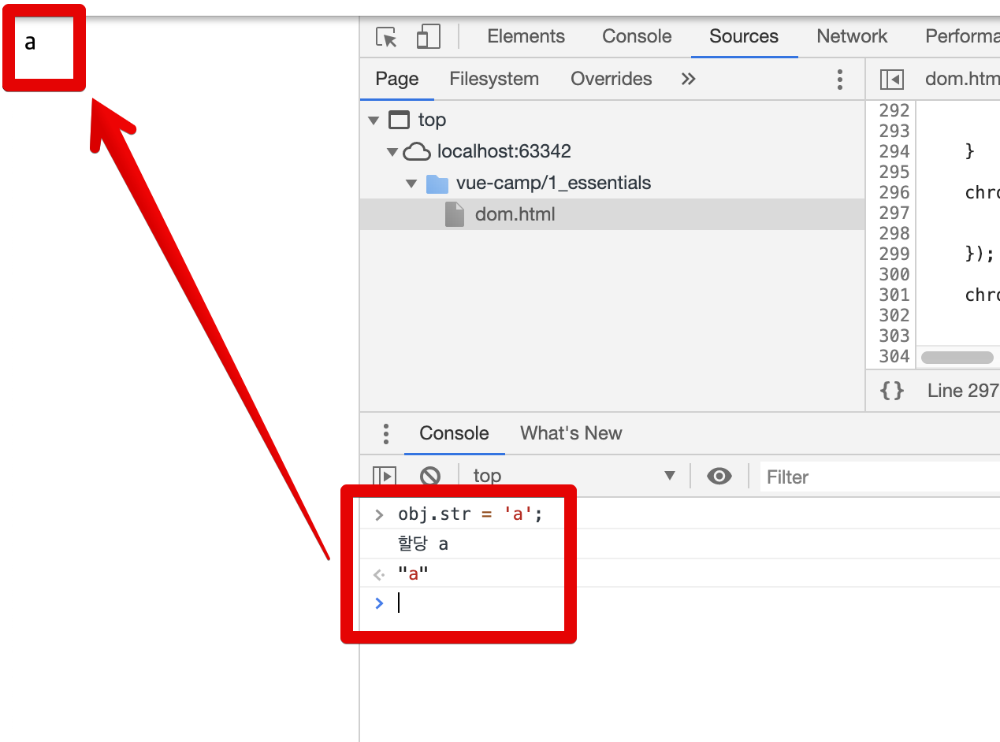
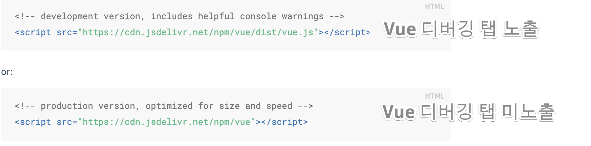
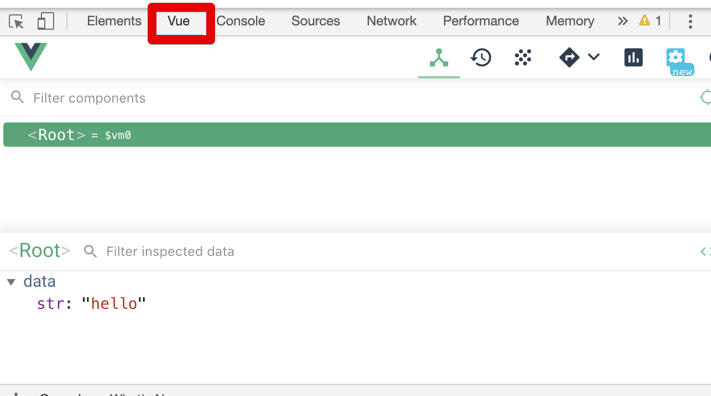
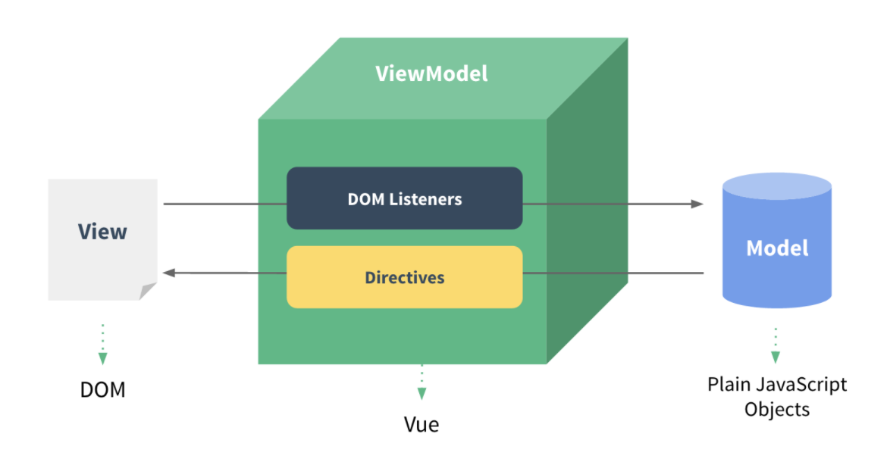
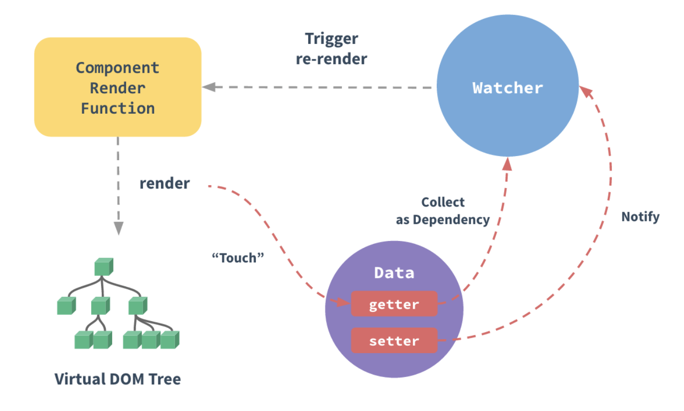

# 강의 1

* 모든 실습은 [Github](https://github.com/jojoldu/vue-camp) 의 코드로 있습니다.
* [Vue 공식 스타일 가이드](https://kr.vuejs.org/v2/style-guide/index.html) 따르기

## 1-1. 현대의 웹 애플리케이션

* 브라우저의 렌더링 과정
  * HTML 를 DOM (Document Object Model) 으로 변환
  * CSS 를 DOM 에 추가 (CSSOM 생성)
  * DOM 으로 렌더트리 생성
  * 렌더트리 배치
  * 렌더트리 그리기

* CSR (Client Side Rendering) vs SSR (Server Side Rendering)

  * 초기 웹 사이트 개발방법은 URL 요청을 받아 해당 문서를 넘겨주는 서버 사이드 렌더링이 주로 쓰임
  * 사용자 경험을 중시하는 웹 개발 트렌드에 따라 Angular, Vue, React 와 같은 자바스크립트 라이브러리를 중심으로 클라이언트 사이드 렌더링이 지배적으로 활용
  * 각 렌더링 기법에 따라 장 / 단점이 확실하여 목적에 맞게 사용하는 것이 중요

## 1-2. 개발환경

* 수업은 VS Code로 진행되나, 저는 IntelliJ Ultimate (Webstrom 내장) 으로 사용했습니다.
* ```!``` + ```tab``` 을 누르면
  * HTML 자동완성
* 각 태그는 ```태그명 + tab``` 으로 자동완성

## 1-3. 실습

### Object.defineProperty()

객체 속성을 재정의 하는 function

* [MDN 공식 설명](https://developer.mozilla.org/ko/docs/Web/JavaScript/Reference/Global_Objects/Object/defineProperty)


```html
<div></div>
<script>
    var div = document.querySelector('div');
    var str = 'hello';
    div.innerText = str;
    str = 'hello world';
    div.innerText = str;

    var obj = {};
    Object.defineProperty(obj, 'str', {
        get: function () {
            // obj.str 했을때 사용될 코드
            console.log('접근');
        },
        set: function (newValue) {
            // obj.str = 10 했을때 사용될 코드
            console.log('할당', newValue);
            div.innerText = newValue;
        }
    });
</script>
```



(Vue 핵심 개념)

* 이로 인해 앞으로 개발자는 Dom 관리가 아니라 **데이터만 관리**하면 된다.

### Vue 실습

**Devlopment vs Production**





(Vue 디버깅 탭)

* 이외에도
  * Uglify & Minify 여부

#### 기존 Dom Selector vs Vue 방식

```html
<button>click me</button>
<script>
    var button = document.querySelector('button');
    button.addEventListener('click', function () {
        console.log('clicked');
    });
</script>
```

```html
<div id="app">
    {{ str }}
    <button v-on:click="logText">click me</button>
</div>
<script src="https://cdn.jsdelivr.net/npm/vue/dist/vue.js"></script>
<script>
    new Vue({
        el: '#app',
        data: {
            str: 'hello'
        },
        methods: {
            logText: function () {
                console.log("clicked");
            }
        }
    })
</script>
```






## 1-4. Vue 개념

```javascript
new Vue({
  el: ,
  template: ,
  data: ,
  methods: ,
  created: ,
  watch: ,
});
```

* 컴포넌트는 최대한 잘게 쪼개야 한다
* 컴포넌트를 쓰는 이유는
  * 최대한 같은 코드를 재사용하기 위해
  * Header / Footer 등