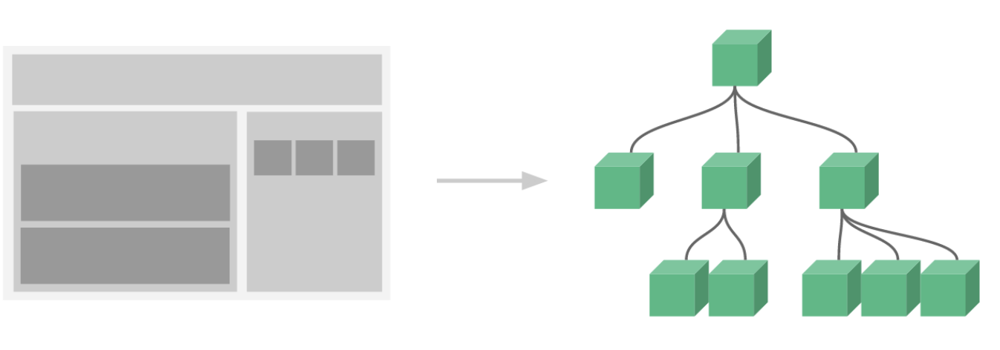
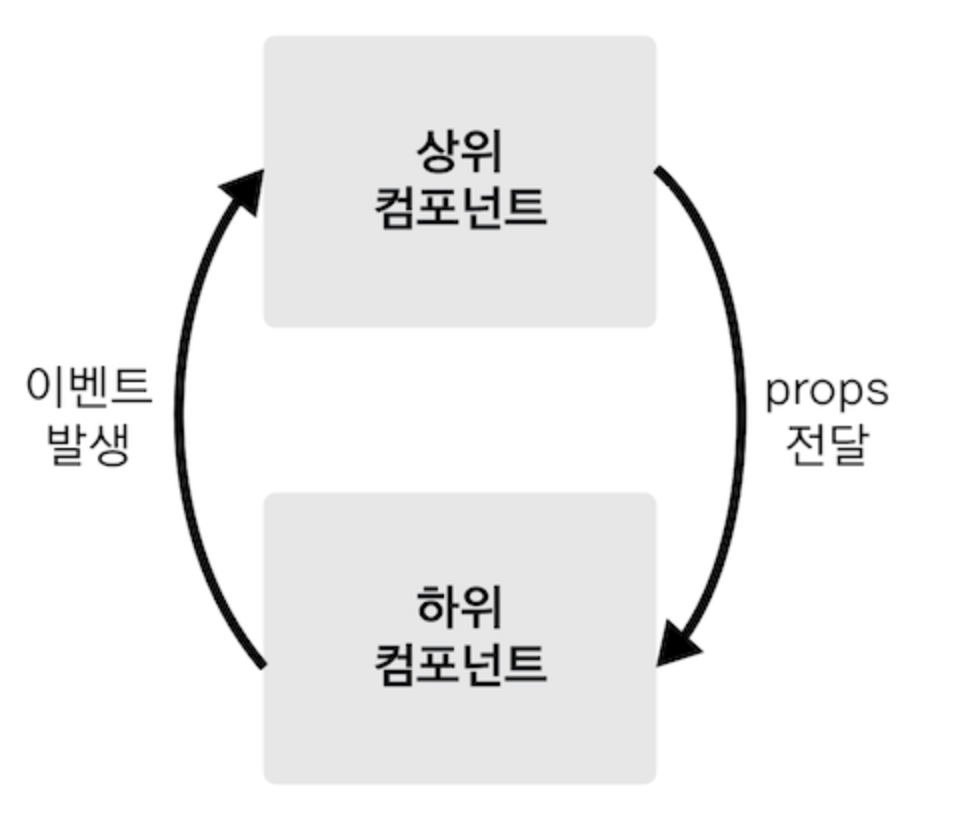

# 강의 2

## 1. Vue의 컴포넌트 구조



기본적인 데이터 & 이벤트 핸들러 방식은 아래와 같다.



* 자식 -> 부모로 데이터 전송을 권장하지 않는다.
* **상위 컴포넌트를 벗어난 엘리먼트**는 대상에 포함되지 않는다.
  * 즉, ```#app``` 밖의 HTML Tag 대상은 데이터를 주고 받는 대상으로 보지 않는다.
* 여기서 데이터 통신 방법을 Props / 이벤트 통신 방법을 Emit이라 한다.
  
## 2. props

* 컴포넌트 간에 **데이터**를 전달 할 수 있는 방법

```html
<body>
    <div id="app">
        <child-component v-bind:propsdata="message"></child-component>
    </div>
    <script src="https://cdn.jsdelivr.net/npm/vue/dist/vue.js"></script>

    <script>
        var childComponent = {
            props: ['propsdata'],
            template: '<p>{{ propsdata }}</p>'
        }

        // 상위 컴포넌트 : root 컴포넌트
        new Vue({
            el: '#app',
            components: {
                'child-component': childComponent
            },
            data: {
                message: 'hello vue.js'
            }
        })
    </script>
</body>
```

## 3. emit

* 컴포넌트간에 이벤트 통신 방법
  * 하위 컴포넌트에서 상위 컴포넌트로 통신한다.

```html
<body>
    <div id="app">
        <child-component v-on:update="showAlert"></child-component>
    </div>
    <script src="https://cdn.jsdelivr.net/npm/vue/dist/vue.js"></script>

    <script>
        var childComponent = {
            methods: {
                sendEvent: function() {
                    this.$emit('update');
                }
            }
        };

        // 상위 컴포넌트 : root 컴포넌트
        new Vue({
            el: '#app',
            components: {
                'child-component': childComponent
            },
            methods: {
                showAlert: function() {
                    alert('event received');
                }
            }
        });
    </script>
</body>
```

## 4. axios

* JS 진영의 대표적인 **HTTP API 통신 모듈**
  * Vue 전용은 아니지만, 워낙 좋아서 Vue에서 사실상 공식으로 사용중
* [jsonplaceholder](https://jsonplaceholder.typicode.com/) 로 Ajax 테스트

* [자바스크립트의 동작원리: 엔진, 런타임, 호출 스택](https://joshua1988.github.io/web-development/translation/javascript/how-js-works-inside-engine/)

```html
<body>
    <div id="app">
        <!--suppress XmlUnboundNsPrefix -->
        <button v-on:click="fetchUser"> get user</button>
    </div>
    <script>
        new Vue({
            el: '#app',
            data: {
                user: {}
            },
            methods: {
                fetchUser: function () {
                    console.log(this);
                    var url = 'https://jsonplaceholder.typicode.com/users/1';
                    var vm = this;
                    axios.get(url)
                        .then(function (response) {
                            console.log(response);
                            vm.user = response.data;
                        })
                        .catch(function (error) {
                            console.log(error);
                        });
                }
            }
        })
    </script>
</body>
```

## CLI

* 빠르게 뷰 프로젝트 생성을 위한 CLI 도구
  * 작성자는 vue cli 4.0.5 로 실습한다.

아래 명령어로 설치한다.

```bash
npm install -g @vue/cli
```

설치 확인은 아래 명령어로 진행한다.

```bash
vue --version
```

명령어 실행시 다음과 같이 CLI의 버전이 등장하면 잘 설치된 것

```bash
@vue/cli 4.0.5
```