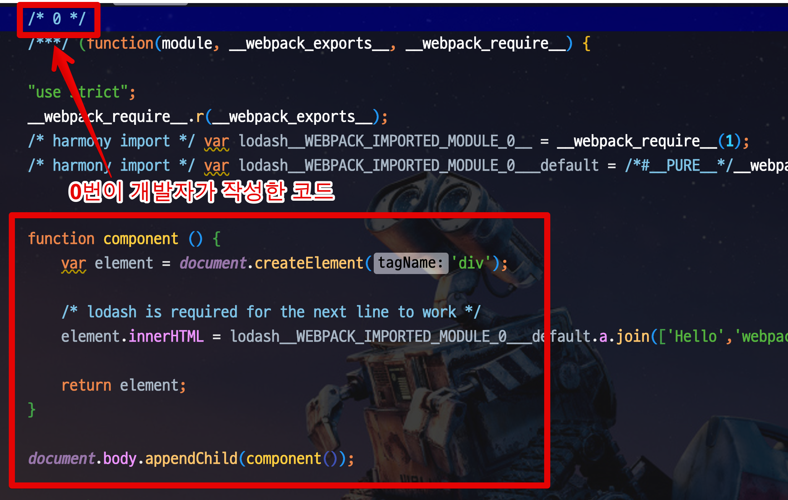
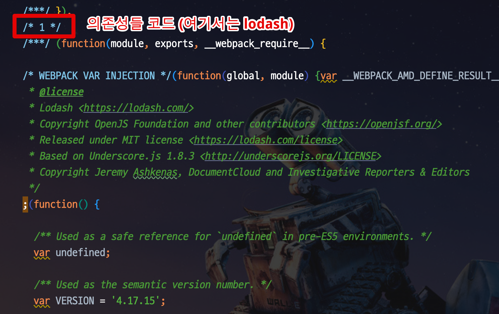

# 강의 4

## 1. 슬롯(slot) 학습 및 실습

### 1-1. 실습환경 구축

```bash
vue create slot-sample
```

CLI 실행시 차례대로 하나씩 선택한다.

```bash
default
babel
in dedicated config files
no
```

```bash
cd slot-sample
npm run serve
```

* 슬롯을 쓰게 되면 컴포넌트를 구현할때, UI 부분을 마음대로 확장할 수가 있다.

> Tip) 컴포넌트는 작게 잡을 수록 좋다.
> 초기에는 큰 범위로 컴포넌트를 잡을텐데, 그럴수록 **조립**하기가 어려우니 작게 잡자.

### 1-2. Slot 예시

**Props로 구현시**  
  
하위컴포넌트

```html
<template>
  <div class="media-card">
    <div class="media-card-image">
      
    </div>
    <div class="media-card-content">
      <h4 class="media-card-heading">
        {{ title }}
      </h4>
      <div class="media-card-body">
        <p>{{ contents }}</p>
      </div>
    </div>
  </div>
</template>

<script>
export default {
  props: ['image', 'title', 'contents']
}
</script>
```

상위컴포넌트
```html
<template>
  <div class="min-h-screen bg-grey-lighter p-8">
    <div class="max-w-xs mx-auto mb-8">
      <photo-card :image="imageLinks[0]" title="Card 1" contents="Card Content 1"></photo-card>
    </div>

    <div class="max-w-xs mx-auto mb-8">
      <photo-card :image="imageLinks[1]" title="Card 2" contents="Card Content 2"></photo-card>
    </div>
  </div>
</template>
```

**Slot으로 구현시**  
  
하위컴포넌트

```html
<template>
  <div class="media-card">
    <div class="media-card-image">
      <slot name="image"></slot>
    </div>
    <div class="media-card-content">
      <slot name="title"></slot>
      <slot name="contents"></slot>
    </div>
  </div>
</template>
```

상위컴포넌트

```html
<template>
  <div class="min-h-screen bg-grey-lighter p-8">
    <div class="max-w-xs mx-auto mb-8">
      <photo-card>
        
        <h4 class="media-card-heading" slot="title">Card 1</h4>
        <div class="media-card-body" slot="contents">Card Content 1</div>
      </photo-card>
    </div>

    <div class="max-w-xs mx-auto mb-8">
      <photo-card>
        
        <h4 class="media-card-heading" slot="title">Card 2</h4>
        <div class="media-card-body" slot="contents">Card Content 2</div>
      </photo-card>
    </div>
  </div>
</template>
<script>
    import PhotoCard from './components/PhotoCard.vue';

    export default {
        components: {
            PhotoCard
        },
    }
</script>
```

> 내가 이해한 Slot.
> 각각의 **하위 컴포넌트**를 조립해야하는 쪽 (즉, 호출자) 에서 여러 컴포넌트들을 어떻게 재사용할지 결정하는 방법
> 일종의 **Override** 같다고 이해

## 2. 웹팩 실습

* 기효님의 [웹팩 가이드](https://joshua1988.github.io/webpack-guide/) 필수 참고

> Tip) [웹팩의 핵심 개념을 시연으로 배우는 영상](https://www.youtube.com/watch?v=WQue1AN93YU)
> 기존 스태틱 파일들 호출들을 일부러 **네트워크 쓰로틀링** 으로 지연요청한 환경을 웹팩을 통해 성능 개선하는 방식이 도움이 많이 된다.

### 2-1. 웹팩 필수 개념 4가지

* entry
* output
* loader
* plugin

이 개념들을 익히는게 이번 시간 목표


```html
<html>
<head>
    <title>webpack 2 demo</title>
   <script src="https://unpkg.com/lodash@4.16.6"></script>
</head>
<body>
<script src="src/index.js"></script>
</body>
</html>
```

```html
<html>
<head>
    <title>webpack 2 demo</title>
</head>
<body>
<script src="dist/main.js"></script>
</body>
</html>
```

### 2-2. 웹팩 빌드 결과물





### 2-3. webpack.config.js

* 매번 build CLI로 설정을 관리할순 없으니 별도의 설정파일이 필요
  * 해당 파일명은 ```webpack.config.js``` 이다.
* ```webpack.config.js```이 있으면 ```webpack``` 명령어가 해당 설정을 기준으로 실행된다.

```js
var path = require('path');

module.exports = {
    mode: 'none', // 최신 웹팩 버전에 추가됨 (none / development / production)
    entry: './src/index.js', // 웹팩 탐색 시작점
    output: { // 웹팩 목적지
        filename: 'main.js',
        path: path.resolve(__dirname, 'dist') //
    }
};
```

### 2-4. Loader

```js
var path = require('path');

module.exports = {
    mode: 'none',
    entry: './index.js',
    output: {
        filename: 'bundle.js',
        path: path.resolve(__dirname, 'dist')
    },
    module: {
        rules: [
            {
                test: /\.css$/,
                /*
                    1. css-loader를 통해 js 에 의존한 css 파일들을 불러오고
                    2. style-loader를 통해 css 코드를 index.html에 <style> 태그에 넣어준다.
                    적용 순서가 **우측에서 좌측순**
                    **js를 제외한 모든 파일들은 필요하면 그에 따른 loader**를 쓴다
                    vue-loader, sass-loader, file-loader (이미지파일용) 등
                 */
                use: ['style-loader','css-loader']
            }
        ]
    }
}
```

### 2-5. Plugin

```js
var path = require('path');
var MiniCssExtractPlugin = require("mini-css-extract-plugin");

module.exports = {
    mode: 'none',
    entry: './index.js',
    output: {
        filename: 'bundle.js',
        path: path.resolve(__dirname, 'dist')
    },
    module: {
        rules: [
            {
                test: /\.css$/,
                /*
                    1. css-loader를 통해 js 에 의존한 css 파일들을 불러오고
                    2. style-loader를 통해 css 코드를 index.html에 <style> 태그에 넣어준다.
                    적용 순서가 **우측에서 좌측순**
                    **js를 제외한 모든 파일들은 필요하면 그에 따른 loader**를 쓴다
                    vue-loader, sass-loader, file-loader (이미지파일용) 등
                 */
                // use: ['style-loader','css-loader']
                use: [
                    { loader: MiniCssExtractPlugin.loader }, // css 번들결과를 별도 파일로 분리해줌
                    "css-loader"
                ]
            }
        ]
    },
    plugins: [ // 웹팩 변환시 부가적인 일을 해주는 라이브러리들 (ex: 압축
        new MiniCssExtractPlugin()
    ],
}
```