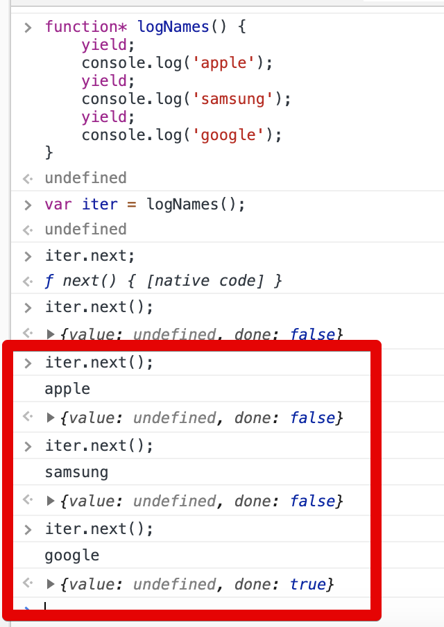

# 강의 8

## Dynamic Route

## Aync & Await

자바 스크립트 비동기 처리

1. 콜백
2. 프로미스
3. 프로미스 + 제너레이터
4. async await

**프로미스** 기반의 코드

```js
created() {
    const newsId = this.$route.params.newsId;
    fetchOneNews(newsId)
        .then(({data}) => {
            console.log(data);
            this.newsItem = data;
        })
        .catch(error => console.log(error));
}
```

**async await** 기반의 코드

```js
async created() {
    const newsId = this.$route.params.newsId;
    const response = await fetchOneNews(newsId);
    this.newsItem = response.data;
}
```

### Generator

```js
function* logNames() {
    yield;
    console.log('apple');
    yield;
    console.log('samsung');
    yield;
    console.log('google');
}
```



* **Async/Await 에 Generator 개념**이 녹아 있음

## Callback Hell

* 콜백헬의 문제는 인덴트가 중요한게 아니다.
  * **에러 핸들링이 최대의 문제**이다.
  * 